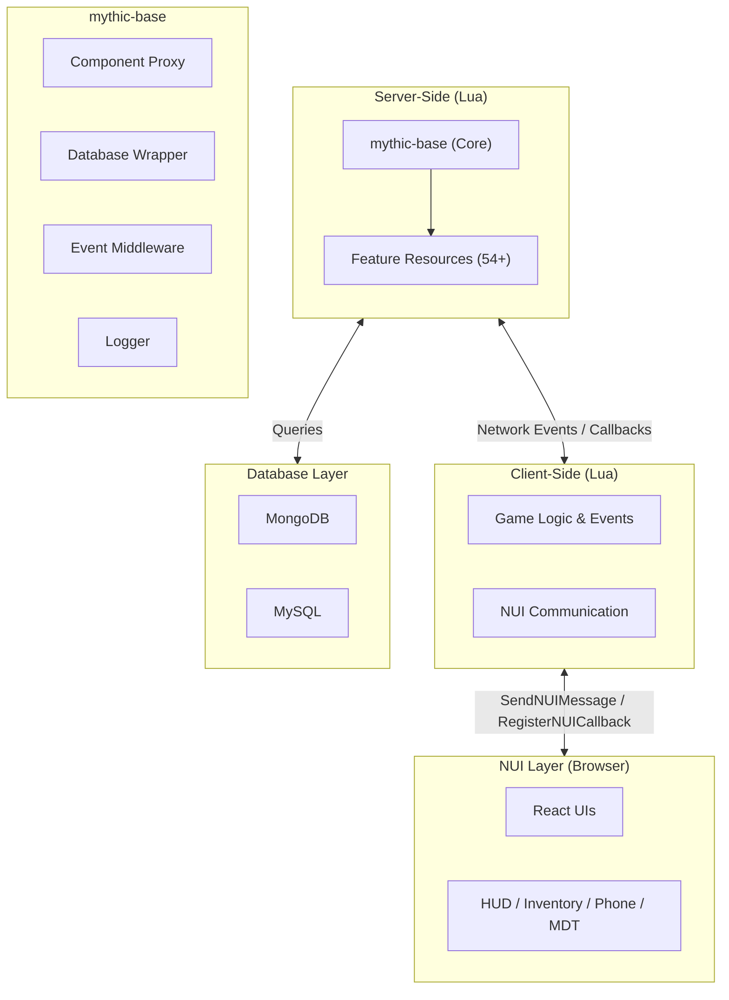
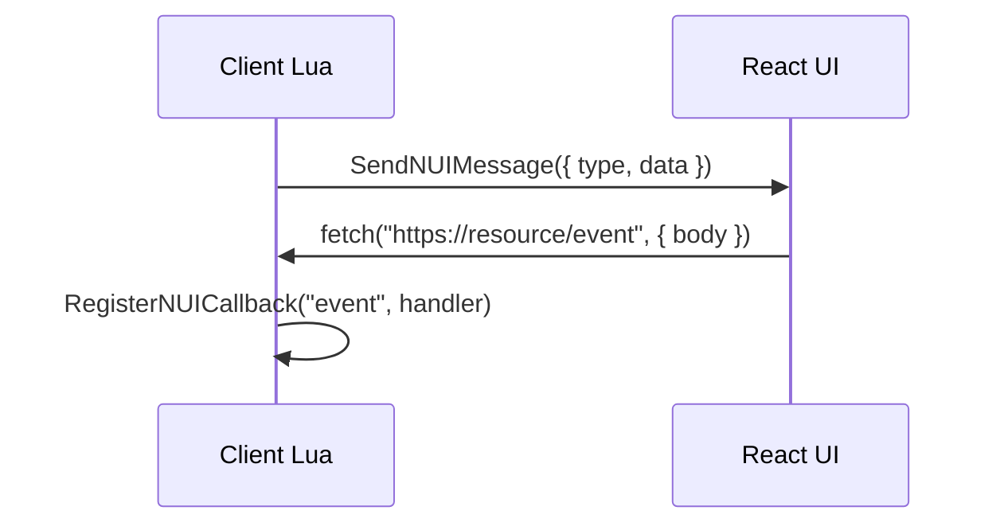
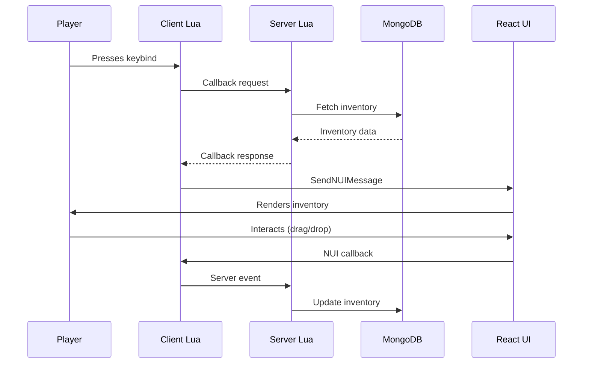
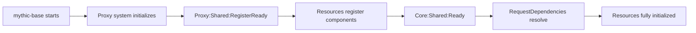

Mythic Framework is a modular, component-based architecture for FiveM built on four pillars:

<CardGroup cols={2}>
  <Card title="Component-Based Design" icon="cubes">
    Modular components that can be registered, fetched, extended, and composed
  </Card>
  <Card title="Event-Driven Communication" icon="bolt">
    Asynchronous event system with middleware for inter-resource communication
  </Card>
  <Card title="Dual-Database Architecture" icon="database">
    MongoDB for flexible game data, MySQL for relational data and compatibility
  </Card>
  <Card title="Modern UI Stack" icon="browser">
    React + Redux/Zustand UIs with NUI bridge
  </Card>
</CardGroup>

## Architecture Diagram



## Core Layer: mythic-base

**Location:** `resources/[mythic]/mythic-base/`

The heart of the framework. Every other resource depends on mythic-base.

| System | Key Files | Purpose |
| :----- | :-------- | :------ |
| Component Proxy | `core/sh_proxy.lua` | RegisterComponent, FetchComponent, ExtendComponent, RequestDependencies |
| Database Wrapper | `core/sv_database.js`, `core/sh_datastore.lua` | MongoDB + MySQL access, DataStore abstraction |
| Event System | `core/sv_events.lua`, `core/sv_middleware.lua`, `core/sv_callback.lua` | Events, middleware, server callbacks |
| Logging | `core/sv_logger.lua`, `core/cl_logger.lua` | Centralized logging with Discord webhooks |
| Player Management | `core/sv_player.lua`, `core/cl_player.lua` | Player data caching, character loading, permissions |
| Utilities | `core/sh_utils.lua`, `core/sh_core.lua` | Common helpers, data validation, table operations |

## Resource Layer

**Location:** `resources/[mythic]/`

All feature resources depend on mythic-base and follow a consistent structure.

<Tabs>
  <Tab title="Core Systems">
    - `mythic-pwnzor` - Anti-cheat
    - `mythic-queue` - Server queue
    - `mythic-characters` - Character system
    - `mythic-loadscreen` - Loading screen
  </Tab>
  <Tab title="Gameplay">
    - `mythic-inventory` - Items & crafting
    - `mythic-jobs` - Job framework
    - `mythic-vehicles` - Vehicle system
    - `mythic-finance` - Banking
    - `mythic-properties` - Housing
    - `mythic-police` - Law enforcement
  </Tab>
  <Tab title="UI">
    - `mythic-hud` - Heads-up display
    - `mythic-phone` - Smartphone
    - `mythic-laptop` - Laptop interface
    - `mythic-mdt` - Mobile Data Terminal
    - `mythic-menu` - Context menus
    - `mythic-chat` - Chat system
  </Tab>
  <Tab title="Utilities">
    - `mythic-targeting` - Interaction system
    - `mythic-polyzone` - Area zones
    - `mythic-animations` - Emotes/animations
    - `mythic-sounds` - Sound effects
    - `mythic-sync` - Time/weather
  </Tab>
</Tabs>

## Communication Patterns

### Component Communication

Resources communicate via the component proxy system:

```lua
-- Resource A registers a component
exports['mythic-base']:RegisterComponent('Inventory', {
    AddItem = function(self, player, item, count)
        -- Add item logic
        return true
    end
})

-- Resource B uses the component
local Inventory = exports['mythic-base']:FetchComponent('Inventory')
local success = Inventory:AddItem(source, 'water', 5)
```

### Callback Communication

Server-client callbacks for request/response patterns:

```lua
-- Server registers a callback
Callbacks:RegisterServerCallback('mythic-garage:GetVehicles', function(source, data, cb)
    local vehicles = GetPlayerVehicles(source)
    cb(vehicles)
end)

-- Client calls the callback
Callbacks:ServerCallback('mythic-garage:GetVehicles', {}, function(vehicles)
    print('Got vehicles:', #vehicles)
end)
```

### NUI Communication

Client Lua and React UI communicate via NUI:



```lua
-- Lua sends to UI
SendNUIMessage({ type = 'OPEN_INVENTORY', data = inventoryData })

-- UI sends back to Lua
RegisterNUICallback('closeInventory', function(data, cb)
    SetNuiFocus(false, false)
    cb('ok')
end)
```

## Data Flow

How all layers connect — example of opening inventory:



## Load Order

Resources must load in the correct order. `mythic-base` must always be first.

```bash
# 1. External dependencies
ensure oxmysql

# 2. Core framework (MUST be first)
ensure mythic-base

# 3. Anti-cheat
ensure mythic-pwnzor

# 4. Core systems
ensure mythic-queue
ensure mythic-loadscreen
ensure mythic-characters

# 5. Feature resources (after core)
ensure mythic-inventory
ensure mythic-jobs
ensure mythic-finance
# ... etc

# 6. UI resources
ensure mythic-hud
ensure mythic-phone
ensure mythic-menu
```

<Warning>
**Do NOT change the load order of core Mythic resources.** They depend on each other and must start in a specific sequence. Changing this order will cause cascading failures across the framework.
</Warning>

## Initialization Flow



Resources use this flow to safely initialize:

```lua
-- Wait for proxy to be ready, then register your component
AddEventHandler('Proxy:Shared:RegisterReady', function()
    exports['mythic-base']:RegisterComponent('MyComponent', { ... })
end)

-- Wait for all core components, then fetch dependencies
AddEventHandler('Core:Shared:Ready', function()
    exports['mythic-base']:RequestDependencies('MyResource', {
        'Inventory', 'Characters'
    }, function(errors)
        if #errors == 0 then
            -- Safe to use all components
            RetrieveComponents()
        end
    end)
end)
```

## Next Steps

<CardGroup cols={2}>
  <Card title="Component System" icon="cubes" href="/concepts/component-system">
    Deep dive into component-based architecture
  </Card>
  <Card title="Proxy Pattern" icon="diagram-project" href="/concepts/proxy-pattern">
    Learn the proxy system that powers Mythic
  </Card>
  <Card title="Event System" icon="bolt" href="/concepts/event-system">
    Understand event-driven communication
  </Card>
  <Card title="Database Architecture" icon="database" href="/concepts/database-architecture">
    MongoDB + MySQL dual-database system
  </Card>
</CardGroup>
