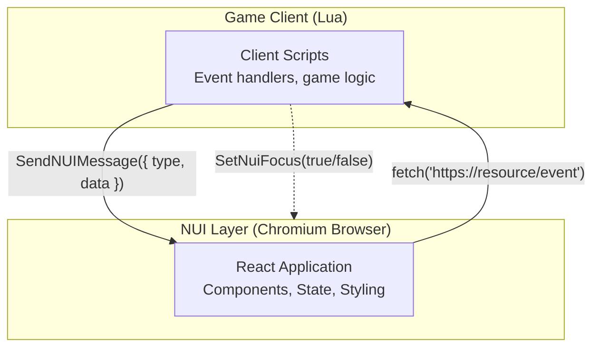
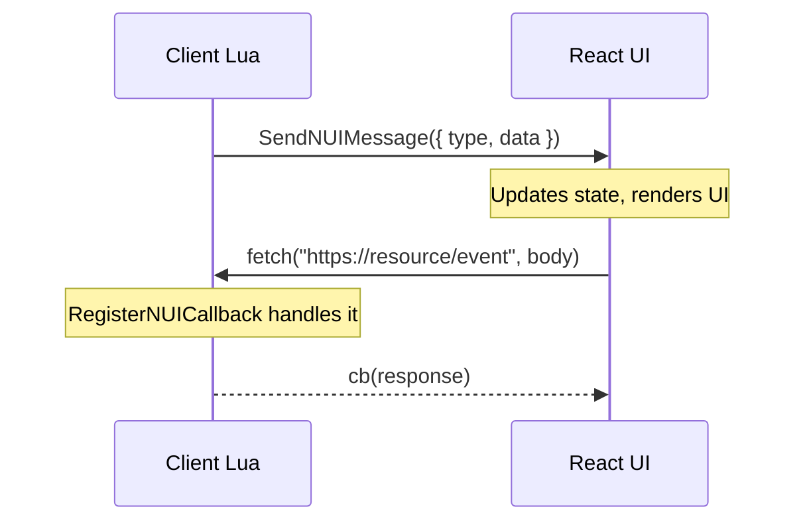

Mythic Framework uses React for all user interfaces, rendered inside FiveM's NUI layer (a Chromium-based browser). Client Lua scripts communicate with React UIs through NUI messages and callbacks.

## UI Architecture



## Technology Stack

Mythic resources use two UI stacks depending on age:

<CardGroup cols={2}>
  <Card title="Legacy UIs" icon="clock-rotate-left">
    **React 17** + Redux + Thunk

    Used by: HUD, Inventory, MDT, Laptop, most existing resources
  </Card>
  <Card title="Modern UIs" icon="sparkles">
    **React 18** + Zustand + TypeScript

    Used by: New Phone UI (`ui-new/`), newer resources
  </Card>
</CardGroup>

Common across both:
- **Material-UI v5** — Component library
- **Emotion** — CSS-in-JS styling
- **Webpack 5** — Module bundler

## UI Resources

<CardGroup cols={2}>
  <Card title="mythic-hud" icon="display">
    Health, armor, status bars, vehicle info, minimap, notifications
  </Card>
  <Card title="mythic-phone" icon="mobile">
    Smartphone with contacts, messages, calls, email, camera, apps
  </Card>
  <Card title="mythic-inventory" icon="box-open">
    Drag-and-drop inventory, tooltips, crafting, shops
  </Card>
  <Card title="mythic-mdt" icon="laptop">
    Police MDT — warrants, person/vehicle lookup, dispatch, reports
  </Card>
  <Card title="mythic-laptop" icon="laptop-code">
    Laptop interface with email, documents, browser
  </Card>
  <Card title="mythic-characters" icon="user">
    Character creation, appearance customization, selection
  </Card>
  <Card title="mythic-menu" icon="bars">
    Context menus with nested submenus and keyboard navigation
  </Card>
  <Card title="mythic-chat" icon="comments">
    In-game chat with commands
  </Card>
</CardGroup>

## Client-UI Communication

### Lua to React (SendNUIMessage)

```lua
-- client/main.lua

-- Open UI with data
SendNUIMessage({
    type = 'OPEN_INVENTORY',
    data = {
        inventory = inventoryData,
        maxSlots = 50,
        maxWeight = 100
    }
})

-- Update specific data
SendNUIMessage({
    type = 'UPDATE_MONEY',
    data = { cash = 5000, bank = 25000 }
})

-- Close UI
SendNUIMessage({ type = 'CLOSE_INVENTORY' })
```

**React side — listening for messages:**

```jsx
// Legacy (Redux pattern)
useEffect(() => {
    const handleMessage = (event) => {
        const { type, data } = event.data;
        switch (type) {
            case 'OPEN_INVENTORY':
                setInventory(data.inventory);
                setVisible(true);
                break;
            case 'CLOSE_INVENTORY':
                setVisible(false);
                break;
        }
    };
    window.addEventListener('message', handleMessage);
    return () => window.removeEventListener('message', handleMessage);
}, []);
```

### React to Lua (NUI Callbacks)

```jsx
// ui/src/utils/fetchNui.js
export const fetchNui = async (eventName, data = {}) => {
    const resourceName = window.GetParentResourceName
        ? window.GetParentResourceName()
        : 'mythic-inventory';

    const response = await fetch(`https://${resourceName}/${eventName}`, {
        method: 'POST',
        headers: { 'Content-Type': 'application/json' },
        body: JSON.stringify(data)
    });

    return await response.json();
};

// Usage in a component
const handleUseItem = (slot) => {
    fetchNui('useItem', { slot }).then((response) => {
        if (response.success) {
            console.log('Item used');
        }
    });
};
```

**Lua side — handling NUI callbacks:**

```lua
-- client/ui.lua
RegisterNUICallback('useItem', function(data, cb)
    local slot = data.slot
    TriggerServerEvent('mythic-inventory:server:UseItem', slot)
    cb({ success = true })
end)

RegisterNUICallback('closeInventory', function(data, cb)
    SetNuiFocus(false, false)
    cb('ok')
end)
```

## Communication Flow



## Custom Hooks

### useNuiEvent

Simplify NUI message handling:

```jsx
import { useEffect } from 'react';

export const useNuiEvent = (action, handler) => {
    useEffect(() => {
        const handleMessage = (event) => {
            const { type, data } = event.data;
            if (type === action) {
                handler(data);
            }
        };
        window.addEventListener('message', handleMessage);
        return () => window.removeEventListener('message', handleMessage);
    }, [action, handler]);
};

// Usage
function InventoryApp() {
    const [visible, setVisible] = useState(false);

    useNuiEvent('OPEN_INVENTORY', () => setVisible(true));
    useNuiEvent('CLOSE_INVENTORY', () => setVisible(false));
}
```

## State Management

### Redux (Legacy UIs)

```jsx
// Store setup
import { createStore, applyMiddleware } from 'redux';
import thunk from 'redux-thunk';

const store = createStore(rootReducer, applyMiddleware(thunk));

// Reducer
const initialState = { items: [], visible: false };

export default function inventoryReducer(state = initialState, action) {
    switch (action.type) {
        case 'SET_INVENTORY':
            return { ...state, items: action.payload.items };
        case 'TOGGLE_VISIBLE':
            return { ...state, visible: !state.visible };
        default:
            return state;
    }
}

// Component
function Inventory() {
    const items = useSelector(state => state.inventory.items);
    const dispatch = useDispatch();

    const handleUseItem = (slot) => dispatch(useItem(slot));

    return (
        <div className="inventory">
            {items.map((item, i) => (
                <ItemSlot key={i} item={item} onClick={() => handleUseItem(i)} />
            ))}
        </div>
    );
}
```

### Zustand (Modern UIs)

```tsx
// Store definition
import { create } from 'zustand';

interface PhoneState {
    visible: boolean;
    notifications: Notification[];
    setVisible: (v: boolean) => void;
    addNotification: (n: Notification) => void;
}

export const usePhoneStore = create<PhoneState>((set) => ({
    visible: false,
    notifications: [],
    setVisible: (visible) => set({ visible }),
    addNotification: (n) => set((s) => ({
        notifications: [...s.notifications, n]
    })),
}));

// Component usage
function PhoneApp() {
    const visible = usePhoneStore((s) => s.visible);
    const notifications = usePhoneStore((s) => s.notifications);

    if (!visible) return null;
    return <div>...</div>;
}
```

## Best Practices

<AccordionGroup>
  <Accordion title="NUI Focus Management" icon="crosshairs">
    Always manage NUI focus properly in Lua:

    ```lua
    -- Open UI: enable cursor and keyboard input
    SendNUIMessage({ type = 'OPEN_UI' })
    SetNuiFocus(true, true)

    -- Close UI: disable cursor and input
    RegisterNUICallback('close', function(data, cb)
        SetNuiFocus(false, false)
        cb('ok')
    end)
    ```
  </Accordion>

  <Accordion title="ESC Key Handling" icon="keyboard">
    Always handle ESC to close UI:

    ```jsx
    useEffect(() => {
        const handleEscape = (e) => {
            if (e.key === 'Escape' && visible) {
                fetchNui('close');
                setVisible(false);
            }
        };
        window.addEventListener('keydown', handleEscape);
        return () => window.removeEventListener('keydown', handleEscape);
    }, [visible]);
    ```
  </Accordion>

  <Accordion title="Visibility Control" icon="eye">
    Don't render hidden UIs — return null:

    ```jsx
    function MyUI() {
        const [visible, setVisible] = useState(false);

        useNuiEvent('OPEN_UI', () => setVisible(true));
        useNuiEvent('CLOSE_UI', () => setVisible(false));

        if (!visible) return null;
        return <div>...</div>;
    }
    ```
  </Accordion>

  <Accordion title="Performance" icon="gauge-high">
    Optimize React rendering:

    ```jsx
    // Memoize expensive components
    const ItemSlot = React.memo(({ item, onClick }) => {
        return <div onClick={onClick}>{item.label}</div>;
    });

    // Cache expensive calculations
    const totalWeight = useMemo(() => {
        return items.reduce((sum, item) => sum + (item.weight * item.count), 0);
    }, [items]);
    ```
  </Accordion>
</AccordionGroup>

## Building UIs

```bash
# Install dependencies
npm install

# Development mode with hot reload
npm run dev

# Production build (outputs to dist/)
npm run build

# Watch mode (rebuilds on file changes)
npm run watch
```

<Note>
Built UI files go into `dist/` which is referenced by `ui_page` in `fxmanifest.lua`. Always run `npm run build` before testing in-game.
</Note>

## Next Steps

<CardGroup cols={2}>
  <Card title="Resource Structure" icon="folder-tree" href="/concepts/resource-structure">
    How UI fits into resource organization
  </Card>
  <Card title="Component System" icon="cubes" href="/concepts/component-system">
    Server/client components that power UIs
  </Card>
  <Card title="Event System" icon="bolt" href="/concepts/event-system">
    Events that trigger UI updates
  </Card>
  <Card title="HUD API" icon="display" href="/api/hud/exports">
    HUD component API reference
  </Card>
</CardGroup>
